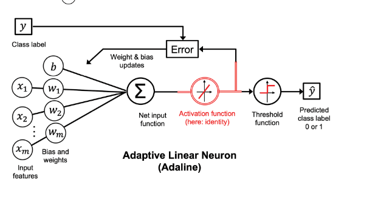

indice:
- [Perceptron](#perceptron)
    - [¿Qué es un Perceptron?](#qué-es-un-perceptron)
    - [Estructura Básica](#estructura-básica)
    - [Funcionamiento Básico](#funcionamiento-básico)
    - [Aplicaciones](#aplicaciones)
- [Adaline](#adaline)
    - [Características principales](#características-principales)
    - [Proceso de Entrenamiento](#proceso-de-entrenamiento)
    - [Ventajas y Desventajas](#ventajas-y-desventajas)
    - [Uso en la Actualidad](#uso-en-la-actualidad)
# Perceptron

El perceptrón es un concepto fundamental en el campo de las redes neuronales y el aprendizaje automático. Es un tipo de unidad básica que simula la función de una neurona en el cerebro humano y se utiliza para realizar tareas de clasificación y toma de decisiones en el ámbito de la inteligencia artificial.

## ¿Qué es un Perceptrón?

En términos simples, un perceptrón es un modelo matemático que toma varias entradas, realiza una suma ponderada de estas entradas y luego aplica una función de activación para producir una salida. La función de activación puede convertir la salida en un valor binario o en un valor continuo, dependiendo de la tarea en cuestión.

## Estructura Básica

Un perceptrón consta de tres componentes principales:

1. **Entradas:** Son valores numéricos que representan las características o atributos del problema que se está abordando.

2. **Pesos:** Cada entrada está asociada con un peso que indica su importancia relativa en la decisión final. Los pesos se ajustan durante el proceso de entrenamiento del perceptrón.

3. **Función de Activación:** Después de realizar una suma ponderada de las entradas multiplicadas por sus pesos, se aplica una función de activación para determinar la salida del perceptrón. Esta función introduce no linealidad en la decisión.

## Funcionamiento Básico

El perceptrón toma las entradas, multiplica cada entrada por su peso correspondiente y luego suma estos productos. Esta suma ponderada se pasa a través de la función de activación, que puede ser una función escalón, una función sigmoide u otras. La salida final se utiliza para clasificar la entrada en diferentes categorías.

## Aplicaciones

El perceptrón se utiliza en diversas aplicaciones, como el reconocimiento de patrones, la clasificación de datos, la toma de decisiones y más. Aunque es un modelo simple, sienta las bases para arquitecturas más complejas de redes neuronales y aprendizaje profundo.

En resumen, el perceptrón es un bloque de construcción fundamental en el campo del aprendizaje automático y las redes neuronales. Aunque es simple en su estructura, su capacidad para realizar tareas de clasificación y toma de decisiones lo convierte en un componente esencial en muchas aplicaciones modernas.

# Adaline

El Adaline (Adaptive Linear Neuron) es un algoritmo de aprendizaje y una arquitectura de red neuronal artificial temprana que tiene aplicaciones en problemas de clasificación y regresión. Fue desarrollado como una mejora con respecto al perceptrón original.

## Características principales

- **Función de Activación Lineal:** A diferencia del perceptrón, que utiliza una función de activación escalón, el Adaline utiliza una función de activación lineal. Esto permite que la salida sea una combinación lineal de las entradas y los pesos ponderados.

- **Aprendizaje Continuo:** El Adaline utiliza un enfoque de aprendizaje basado en el descenso de gradiente para ajustar los pesos de manera continua. Esto permite que el Adaline realice ajustes finos a los pesos para minimizar el error cuadrático medio entre las predicciones y las salidas reales.

- **Minimización del Error:** El objetivo principal del Adaline es minimizar el error cuadrático medio entre las predicciones del modelo y las salidas deseadas. Esto se logra ajustando los pesos en la dirección que reduce gradualmente este error.

## Proceso de Entrenamiento

1. **Inicialización:** Se inicializan los pesos y, opcionalmente, el sesgo con valores pequeños.

2. **Cálculo de Salida:** Para cada entrada, se calcula la salida del Adaline como la combinación lineal de las entradas ponderadas por los pesos.

3. **Cálculo del Error:** Se calcula el error entre la salida calculada y la salida deseada.

4. **Ajuste de Pesos:** Utilizando el descenso de gradiente, se ajustan los pesos en la dirección que reduce el error. La tasa de aprendizaje controla la magnitud de los ajustes.

5. **Iteración:** Los pasos 2 a 4 se repiten iterativamente utilizando todo el conjunto de entrenamiento hasta que el error converja a un valor mínimo o hasta que se alcance un número predeterminado de iteraciones.

## Ventajas y Desventajas

**Ventajas:**
- Adecuado para problemas de regresión lineal y clasificación binaria.
- Puede capturar relaciones lineales en los datos.

**Desventajas:**
- Limitado a relaciones lineales, no puede capturar patrones no lineales en los datos.
- Puede ser sensible a la escala de las características.

## Uso en la Actualidad

Aunque el Adaline es un modelo más simple en comparación con las redes neuronales modernas, sentó las bases para el desarrollo posterior de algoritmos y arquitecturas más complejas en el campo del aprendizaje automático y la inteligencia artificial. En la actualidad, sus conceptos siguen siendo relevantes en la comprensión de cómo funcionan las redes neuronales y cómo se realiza el entrenamiento mediante la optimización del descenso del gradiente.

Para aprender más sobre redes neuronales y su evolución, es importante explorar tanto los modelos clásicos como los enfoques más avanzados.
